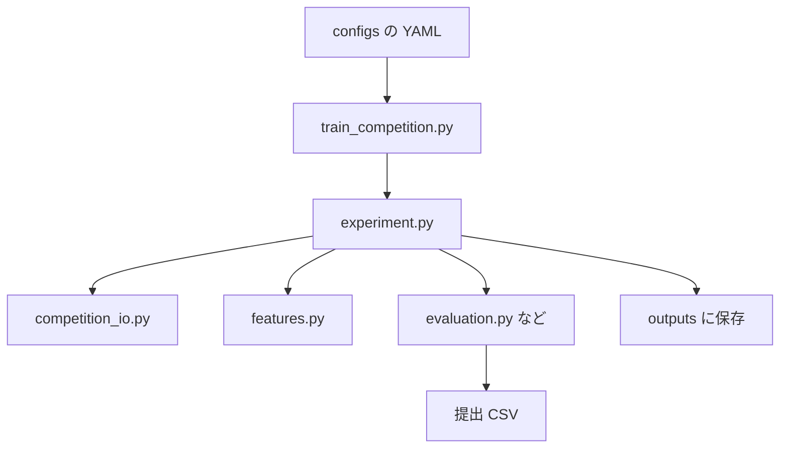

# プロジェクトの見方（初学者向け）

このドキュメントは、「このリポジトリのフォルダと Python ファイルが、それぞれ何の役割か」を初めて触る人向けに説明します。  
すでに [README.md](../README.md) にセットアップ手順があるので、ここでは**コードの地図**に重点を置きます。

## 用語がわからないとき

- **Python ファイル（`.py`）**: プログラムの本体。実行すると処理が動きます。
- **モジュール**: フォルダ内の `.py` ファイルのこと。`src` 以下は「学習やデータ処理の部品」をまとめたモジュール置き場です。
- **パッケージ**: `src` のように `__init__.py` があるフォルダ。`python -m src.〇〇` のようにまとめて import できます。
- **YAML（`.yaml`）**: 人間が読み書きしやすい設定ファイル。パスやモデル名などをここに書き、Python が読み込みます。

---

## `src/` フォルダ（Python コード本体）

コンペ用の「データを読む → 特徴量を作る → 学習・評価 → 提出ファイルを書く」処理のほとんどがここにあります。  
ファイルごとの役割は次のとおりです。

| ファイル | 一言で |
|----------|--------|
| [__init__.py](../src/__init__.py) | `src` をパッケージとして認識させる印（中身は空でもよいことが多い） |
| [train_competition.py](../src/train_competition.py) | **コマンドの入口**。実験を起動するときに実行するファイル |
| [experiment.py](../src/experiment.py) | **実験の司令塔**。データ読込から学習・提出までの流れを並べる |
| [competition_io.py](../src/competition_io.py) | **入出力**。CSV の読み書き、提出用 CSV の形式合わせ |
| [features.py](../src/features.py) | **特徴量**。スペクトルから学習用の数値列を組み立てる |
| [preprocessing.py](../src/preprocessing.py) | **前処理**。SNV や MSC など、スペクトル行ごとの変換 |
| [models.py](../src/models.py) | **モデル工場**。名前（ridge など）とパラメータから学習器オブジェクトを作る |
| [cv.py](../src/cv.py) | **交差検証の分割**。何通りにデータを折って学習／検証するか |
| [metrics.py](../src/metrics.py) | **評価指標**。例: RMSE（誤差の大きさ） |
| [evaluation.py](../src/evaluation.py) | **1 モデルの学習と評価**。fold ごとに学習し、OOF やテスト予測を作る |
| [tuning.py](../src/tuning.py) | **ハイパーパラメータ探索**（Optuna）。LightGBM 用のオプション処理 |
| [ensemble.py](../src/ensemble.py) | **アンサンブル**。複数モデルの予測を重み付けしてまとめる、クリップなど |
| [outputs.py](../src/outputs.py) | **成果物の保存**。CSV・JSON・README などを実験フォルダに書き出す |
| [baseline.py](../src/baseline.py) | **最も単純な提出の例**。CV なしで Ridge を 1 回学習して提出 CSV を作る |

以下、もう少しだけ詳しく書きます。

### `train_competition.py`

ターミナルから次のように実行するときの**表のエントリ**です。

```bash
python -m src.train_competition --config configs/exp003_smoke.yaml
```

- グラフライブラリが使うキャッシュ場所（`MPLCONFIGDIR`）を先に設定してから、本処理を import します。
- 実際の処理の流れは `experiment.run_experiment` に任せています。

### `experiment.py`

「実験 1 回分」の**ストーリーライン**がここにあります。

1. 設定 YAML を読む  
2. 学習・テスト CSV を読む（`competition_io`）  
3. 特徴量を作る（`features`）  
4. 設定に書かれた各モデルを学習・評価（`tuning` → `evaluation`）  
5. アンサンブル（`ensemble`）  
6. 提出 CSV を書く（`competition_io`）  
7. ログ用ファイルを保存（`outputs`）

### `competition_io.py`

- 文字コードが違う CSV でも読めるようにするなど、**データ読み込みの細かい工夫**があります。
- `CompetitionData` という型で、学習データ・テストデータ・提出サンプル・波数列の情報をまとめて渡します。
- **提出用 CSV** をコンペの形式に合わせて保存する関数もここです。

### `preprocessing.py` と `features.py`

- **preprocessing**: スペクトル 1 行（1 サンプル）に対する変換（SNV、MSC、微分など）。
- **features**: 変換のブロックを組み合わせ、**モデルに入れる表（DataFrame）** を学習用・テスト用に作ります。PCA や帯域の要約などもここです。

### `models.py`

YAML に `name: ridge` のように書かれた文字列から、**scikit-learn や LightGBM の学習器**を組み立てます。  
モデル種類を増やすときは、だいたいこのファイルを触ります。

### `cv.py`

**交差検証（Cross-Validation）**で「学習に使う行」と「そのとき検証に使う行」を決めます。  
樹種がテストに出てこないコンペ想定では、`species number` をグループにした **GroupKFold** が主に使われます。

### `metrics.py`

予測と正解のずれを数値化します。いまは **RMSE**（二乗平均誤差の平方根）だけです。

### `evaluation.py`

設定で決めた fold に沿って、**同じモデルを何度か学習**します。

- 検証データに対する予測をつなぎ合わせたものを **OOF（Out-of-Fold）** と呼びます。
- テストデータへの予測は fold ごとの平均などでまとめます。

### `tuning.py`

**Optuna** というライブラリで LightGBM のパラメータを自動探索するときの処理です。  
Optuna を入れていない、または設定でオフのときは、ほぼ何もせず元のパラメータを返します。

### `ensemble.py`

複数モデルの予測を **重み付き平均** します。重みは YAML で指定するか、CV の RMSE から自動で決めます。  
そのあと、必要なら予測値を **クリップ**（下限・上限で切る）します。

### `outputs.py`

実験フォルダに、**あとから結果を追いかけるためのファイル**を書きます。

- 例: `fold_scores.csv`、`model_summary.csv`、`oof_predictions.csv`、`metadata.json` など。

### `baseline.py`

「とにかく提出ファイルを 1 本出したい」ときの**最短ルート**です。  
全学習データで Ridge を 1 回だけ fit し、テストを予測します。**本番の CV 付きパイプラインとは別物**として理解するとよいです。

### `__init__.py`

Python が `src` を**パッケージ**として扱うためのファイルです。  
`python -m src.train_competition` のように `-m src.〇〇` で実行できるようになります。

---

## プロジェクトの他のフォルダ（地図）

ルート直下の主なフォルダの意味です。

| フォルダ | 役割 |
|----------|------|
| [config/](../config/) | **共通の薄い設定**（baseline 用の `default.yaml` など）。`config/README.md` 参照 |
| [configs/](../configs/) | **実験ごとの YAML**（`exp003_smoke.yaml` など）。`train_competition` が `--config` で読む（補足: [configs/README.md](../configs/README.md)） |
| [data/](../data/) | **データ置き場**。生データは `data/raw/`（`train.csv` など）。加工済みは `data/processed/` |
| [docs/](../docs/) | **説明ドキュメント**。運用手順、パイプライン説明、このガイドなど |
| [jobs/](../jobs/) | **計算クラスタ向けのジョブスクリプト**（`qsub` で投げるシェル）。`JOB_SCRIPT_GUIDE.md` と [jobs/README.md](../jobs/README.md) を参照 |
| [logs/](../logs/) | ジョブの標準出力・標準エラーを保存するときの置き場（運用で使う） |
| [models/](../models/) | 学習済みモデルファイルを置く想定のフォルダ（用途に応じて使う） |
| [notebooks/](../notebooks/) | **Jupyter Notebook**（EDA や試行錯誤用） |
| [outputs/](../outputs/) | **成果物**。[outputs/README.md](../outputs/README.md) のとおり `experiments/` と `submissions/` に分かれる |
| [scripts/](../scripts/) | **シェルや補助 Python**（セットアップ、提出、EDA レポート生成など）。[scripts/README.md](../scripts/README.md) 参照 |
| [src/](../src/) | 上記の Python 本体 |
| [tests/](../tests/) | **自動テスト**（`pytest`）。[tests/README.md](../tests/README.md) 参照 |

### ルートにあるファイルの例

| ファイル | 役割 |
|----------|------|
| [README.md](../README.md) | セットアップ、SIGNATE、ジョブ実行の入口 |
| [requirements.txt](../requirements.txt) | Python パッケージの依存一覧（`pip install -r`） |
| [experiment_log.md](../experiment_log.md) | 実験 ID と結果・メモを人間が追記するログ |

---

## 処理の流れ（ざっくり図）



---

## 次に読むとよいドキュメント

- コンペ用パイプラインの全体像: [competition_pipeline.md](competition_pipeline.md)
- クラスタでの GPU / qsub: [cluster_gpu_commands.md](cluster_gpu_commands.md)
- ジョブから提出まで: [job_to_submit_flow.md](job_to_submit_flow.md)
